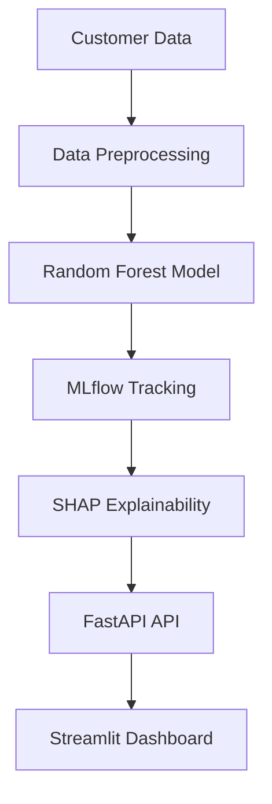
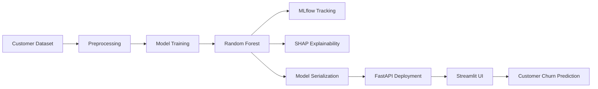

# Customer Churn Prediction MLOps Project

## Project Overview

This project predicts customer churn using Machine Learning and demonstrates a complete MLOps workflow including:

* Data Preprocessing
* Machine Learning Model Training
* Model Tracking using MLflow
* Explainability using SHAP
* Data Drift Monitoring using Evidently AI
* FastAPI Deployment
* Streamlit Frontend
* GitHub Version Control

## Problem Statement

Customer churn is a major challenge for subscription-based businesses. This project predicts whether a customer is likely to leave a service based on demographic, service usage, and billing information.

## Tech Stack

### Machine Learning

* Python
* Scikit-Learn
* Pandas
* NumPy

### MLOps

* MLflow
* SHAP
* Evidently AI

### Deployment

* FastAPI
* Streamlit

### Version Control

* Git
* GitHub

## Project Architecture

## MLOps Workflow

## Features

* Customer Churn Prediction
* Model Experiment Tracking
* Feature Importance Analysis
* Data Drift Monitoring
* REST API Deployment
* Interactive Web Interface

## Results

Model Used:

* Random Forest Classifier

Performance Metrics:

* Accuracy: Add your final accuracy here

## Run Project

### Create Virtual Environment

python -m venv venv

### Activate Environment

venv\Scripts\activate

### Install Requirements

pip install -r requirements.txt

### Start FastAPI

uvicorn src.api:app --reload

### Start Streamlit

streamlit run app/streamlit_app.py

### Start MLflow

mlflow ui

## Author

Devika M

Data Science | Machine Learning | MLOps
